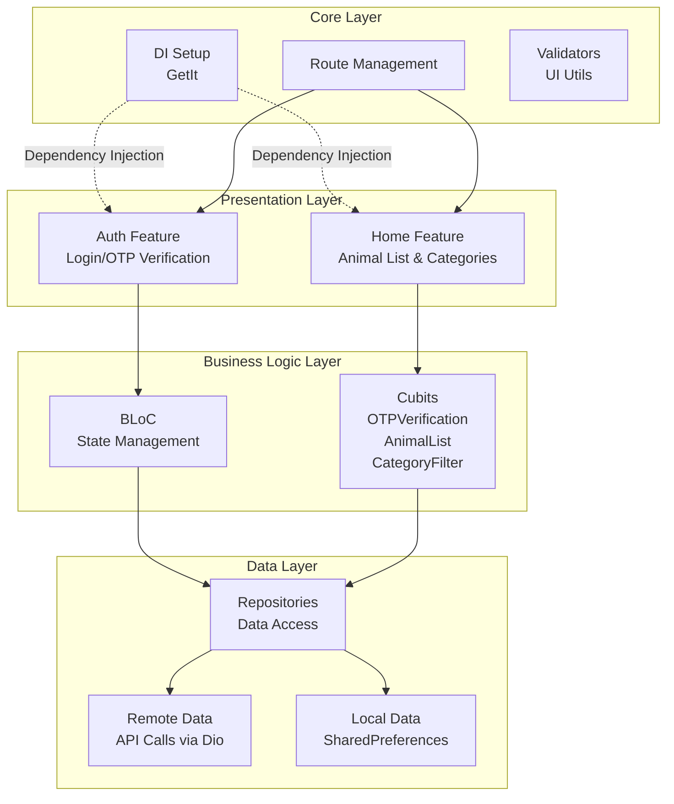

# AnimoApp - Project Architecture & Structure

## 📋 Project Overview

**AnimoApp** is a Flutter mobile application for discovering and managing animals. The app features user authentication via OTP, animal browsing with category filtering, and local data persistence.

**SDK:** Flutter 3.9.2+  
**Version:** 1.0.0+1  
**Supported Platforms:** Android, iOS, Windows, Web

---

## 🏗️ Architecture Overview



---

## 📁 Project Structure

### Root Level Files
```
animoapp/
├── pubspec.yaml              # Flutter dependencies & project config
├── analysis_options.yaml     # Code analysis rules
├── devtools_options.yaml     # DevTools configuration
├── flutter_native_splash.yaml# App splash screen config
├── animoapp.iml              # IntelliJ project file
├── README.md                 # Project documentation
└── PROJECT_ARCHITECTURE.md   # This file
```

---

### Lib Folder Structure

#### **lib/main.dart**
- Application entry point
- Initializes GetIt (dependency injection)
- Initializes SharedPreferences
- Checks authentication token
- Sets up ScreenUtil for responsive design
- Configures BLoCs and route management

---

#### **lib/core/** - Core Application Logic

```
core/
├── DI/
│   └── getit.dart              # Dependency Injection setup
│                                # Registers all repositories & cubits
│
├── routes/
│   ├── routesname.dart         # Route names constants
│   └── routesmanager.dart      # Route navigation & transitions
│
├── database/
│   ├── local/
│   │   └── sharedprefrence/
│   │       └── sharedprefmanager.dart  # Local storage wrapper
│   └── remote/                  # API setup (placeholder)
│
├── function/                    # Utility functions & validators
│   ├── _isValidEmail.dart       # Email validation
│   ├── _isValidPhone.dart       # Phone validation
│   ├── _arePasswordRulesMet.dart # Password validation
│   ├── confvalidator.dart       # Confirmation validator
│   ├── errorvalidator.dart      # Error validation
│   ├── sinupvalidator.dart      # Sign-up validator
│   ├── snackbarshowerror.dart   # Error notification UI
│   ├── imagebutton.dart         # Reusable image button widget
│   └── passvlidatorrules.dart   # Password rules helper
│
├── resource/                    # Constant resources & styling
│   ├── assetvaluemanger.dart    # Asset paths (images, fonts)
│   ├── colormanager.dart        # Color palette
│   ├── constantsmanager.dart    # App constants
│   └── screenutilsmaanger.dart  # Responsive design helpers
│
├── service/                     # Business logic services
└── widget/                      # Reusable widgets
```

---

#### **lib/feature/** - Feature Modules

##### **1. Auth Feature**
```
feature/Auth/
├── otpverifcation/            # OTP verification subfeature
│   ├── data/
│   │   ├── model/             # OTP models/DTOs
│   │   └── repo/
│   │       └── Otpvrefication.dart  # OTP repository
│   │
│   └── presentation/
│       ├── pages/             # UI screens
│       └── manager/           # State management
│           ├── cubit/
│           │   └── otpvericationcontroller_cubit.dart
│           └── state/         # Cubit states
```

**Responsibilities:**
- User login with credentials
- OTP verification process
- Session token management
- Authentication state tracking

---

##### **2. Home Feature**
```
feature/home/
├── data/                      # Data layer
│   ├── model/                 # Animal & Category models
│   ├── datasource/            # Remote/Local data sources
│   └── repo/                  # Repository implementation
│
├── domain/                    # Domain layer (optional)
│   ├── entity/                # Business entities
│   ├── repo/                  # Abstract repositories
│   └── usecases/              # Use cases
│
└── presentation/              # Presentation layer
    ├── pages/                 # UI screens
    │   └── home_page.dart
    │   └── animal_list.dart
    │   └── category_filter.dart
    │
    └── manager/               # State management
        └── cubit/
            ├── animal_cubit_cubit.dart      # Animal list state
            └── categorycontroller_cubit.dart # Category filtering state
```

**Responsibilities:**
- Display animal listings
- Category-based filtering
- Animal details view
- Pagination/Load more

---

## 🔧 Core Technologies & Dependencies

| Package | Version | Purpose |
|---------|---------|---------|
| **flutter_bloc** | ^9.1.1 | State management |
| **get_it** | ^8.3.0 | Dependency injection |
| **flutter_screenutil** | ^5.9.3 | Responsive UI design |
| **dio** | ^5.9.0 | HTTP client for API calls |
| **shared_preferences** | ^2.5.4 | Local key-value storage |
| **flutter_svg** | ^2.2.3 | SVG asset support |
| **flutter_native_splash** | ^2.4.7 | Splash screen |
| **image_picker** | ^1.2.1 | Image selection |
| **connectivity_plus** | ^7.0.0 | Network connectivity check |
| **dartz** | ^0.10.1 | Functional programming (Either type) |
| **quickalert** | ^1.1.0 | Alert dialogs |
| **dotted_border** | ^3.1.0 | UI components |
| **shimmer_animation** | ^2.2.2+1 | Loading animations |
| **modal_progress_hud_nsn** | ^0.5.1 | Loading overlay |

---

## 📱 Platform Configuration

### Android (`android/`)
- Gradle-based build system
- BuildConfig variations (debug, release, profile)
- Kotlin support

### iOS (`ios/`)
- Xcode project (Runner.xcworkspace)
- CocoaPods dependency management
- Native code bridges (AppDelegate.swift)

### Windows (`windows/`)
- CMake build system
- C++ implementation
- Flutter plugin registration

### Web (`web/`)
- HTML5 support
- Progressive Web App (PWA) capabilities
- Asset manifest

---

## 🔐 Authentication Flow

```
User Input (Login)
    ↓
Validate Credentials
    ↓
API Call (Dio)
    ↓
Receive Token
    ↓
Store Token (SharedPrefs)
    ↓
OTP Verification
    ↓
Verify OTP Code
    ↓
Set Authentication Status
    ↓
Navigate to Home
```

---

## 🎨 Design System

### Assets
```
assets/
├── fonts/
│   └── Poppins/               # Primary font family
└── image/
    └── Animoo app/
        └── Iconly/            # Icon set
```

### Responsive Design
- Uses **flutter_screenutil** with base design size: `375 x 812`
- Scales UI elements proportionally across device sizes

### Colors & Styling
- Centralized in `colormanager.dart`
- Consistent branding through `assetvaluemanger.dart`

---

## 🚀 Data Flow

### 1. Local Data (SharedPreferences)
```
App Start
    ↓
Check Stored Token (SharedPrefManager)
    ↓
If Token Exists → Navigate to Home
If No Token → Navigate to Auth
```

### 2. Remote Data (API via Dio)
```
User Action
    ↓
BLoC/Cubit Emits Event
    ↓
Repository Method Called
    ↓
Dio Makes HTTP Request
    ↓
Parse Response to Model
    ↓
Return via Either<Failure, Success>
    ↓
BLoC/Cubit Updates State
    ↓
UI Rebuilds
```

---

## 📊 State Management Pattern

### BLoC/Cubit Hierarchy

**OTPVerificationController (Cubit)**
- Manages OTP verification flow
- Handles state: initial, loading, success, error

**AnimalCubit**
- Manages animal list data
- Handles pagination & loading states

**CategoryControllerCubit**
- Manages category filtering
- Handles selected category state

---

## ✅ Validation System

The app includes comprehensive validators in `core/function/`:

| Validator | Validates |
|-----------|-----------|
| `_isValidEmail` | Email format |
| `_isValidPhone` | Phone number format |
| `_arePasswordRulesMet` | Password strength requirements |
| `confvalidator` | Confirmation matching |
| `sinupvalidator` | Sign-up form |

Error handling via `snackbarshowerror.dart` displays validation failures to users.

---

## 🛣️ Route Management

Navigation is centralized in `routesmanager.dart`:
- Named routes for all screens
- Smooth transitions
- Route guards for authentication

**Route Names** (from `routesname.dart`):
- Auth routes: login, OTP verification
- Home routes: animal list, categories, details

---

## 📦 Getting Started

### Prerequisites
```bash
Flutter SDK ^3.9.2
Dart SDK ^3.9.2
```

### Installation
```bash
# Clone repository
git clone <repo-url>

# Get dependencies
flutter pub get

# Run the app
flutter run
```

### Build
```bash
# Android Release
flutter build apk --release

# iOS Release
flutter build ios --release

# Windows Release
flutter build windows --release

# Web Release
flutter build web --release
```

---

## 🔍 Code Organization Principles

1. **Separation of Concerns** - Data, business logic, and UI are separated
2. **Reusability** - Core components and widgets are centralized
3. **Maintainability** - Constants and resources are managed globally
4. **Scalability** - Feature-based modular structure allows easy expansion
5. **Dependency Injection** - GetIt manages all dependencies
6. **Functional Programming** - Dartz provides Either type for error handling

---

## 📝 File Naming Conventions

- **Dart Files**: `snake_case.dart`
- **Classes**: `PascalCase`
- **Variables/Functions**: `camelCase`
- **Constants**: `CONSTANT_CASE` or `camelCase`

---

## 🔗 Key Integration Points

### Entry Point
- **main.dart** - Initializes all services and runs the app

### Dependency Injection
- **getit.dart** - Registers services, repositories, cubits

### Navigation
- **routesmanager.dart** - Handles all route transitions

### Local Storage
- **sharedprefmanager.dart** - Manages local data persistence

### API Communication
- **Dio** - HTTP client configured in repositories

---

## 📚 Future Enhancement Areas

- [ ] Add authentication refresh token mechanism
- [ ] Implement offline-first data synchronization
- [ ] Add unit & widget tests
- [ ] Implement advanced caching strategies
- [ ] Add analytics tracking
- [ ] Internationalization (i18n)
- [ ] Dark mode support
- [ ] Push notifications

