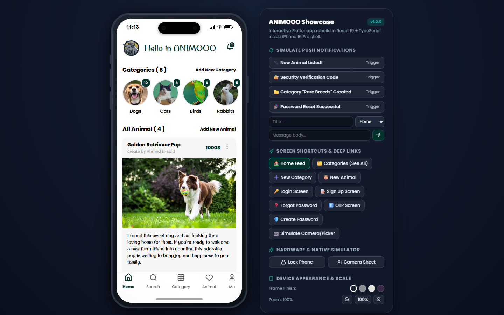
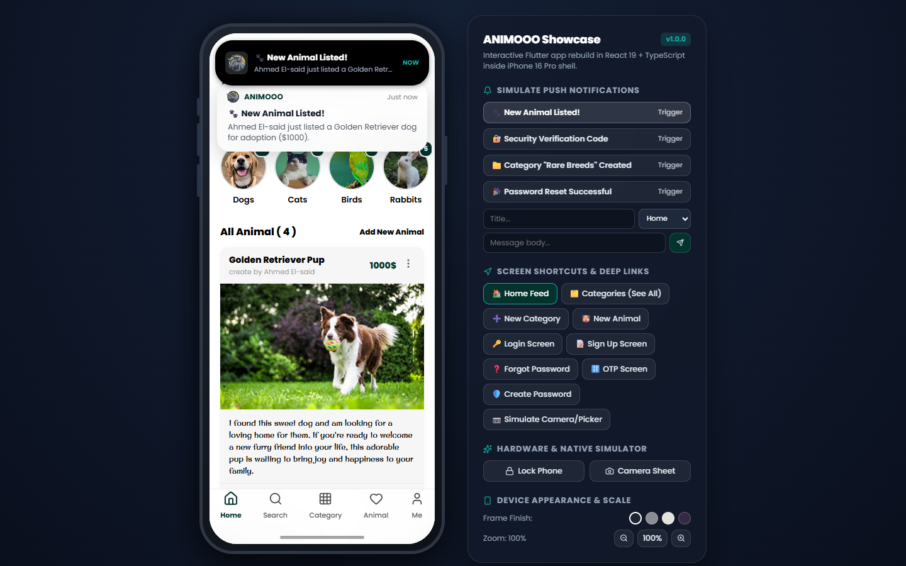
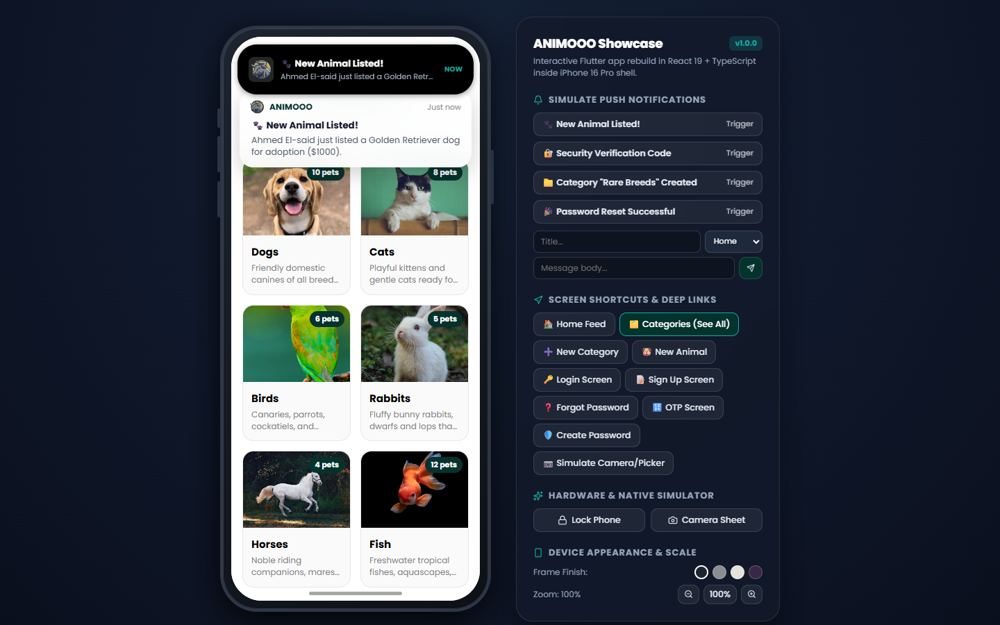
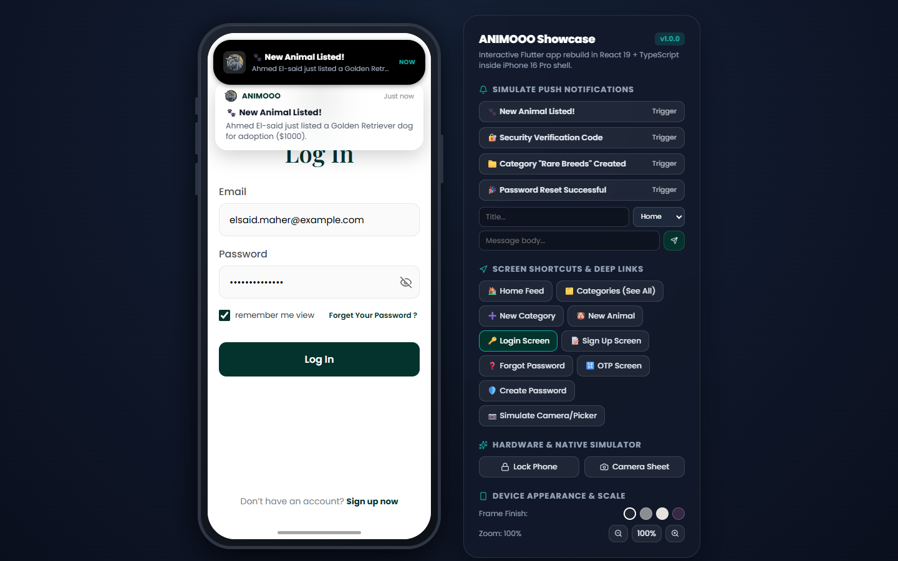
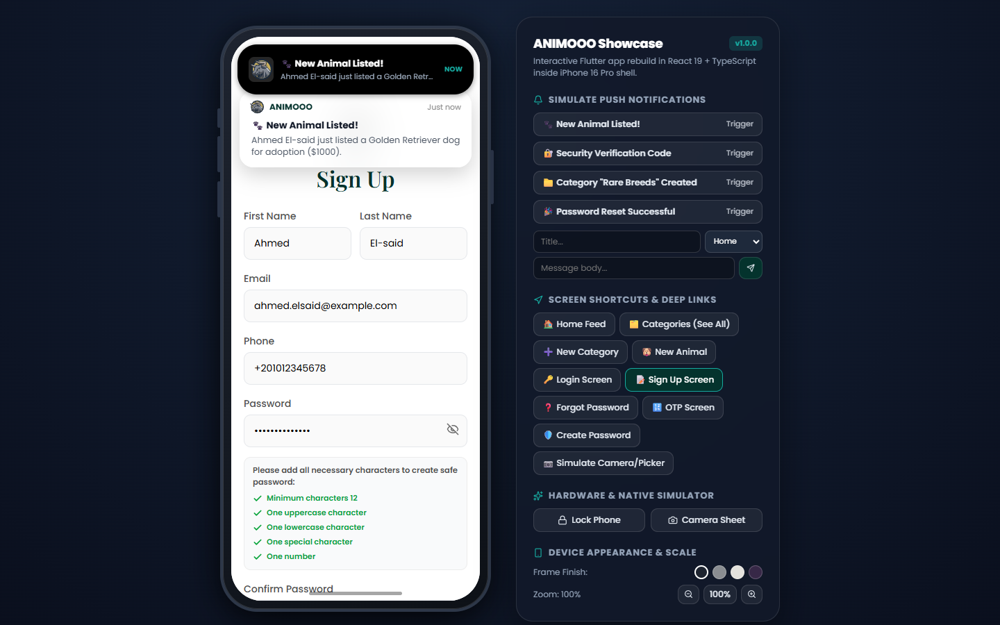
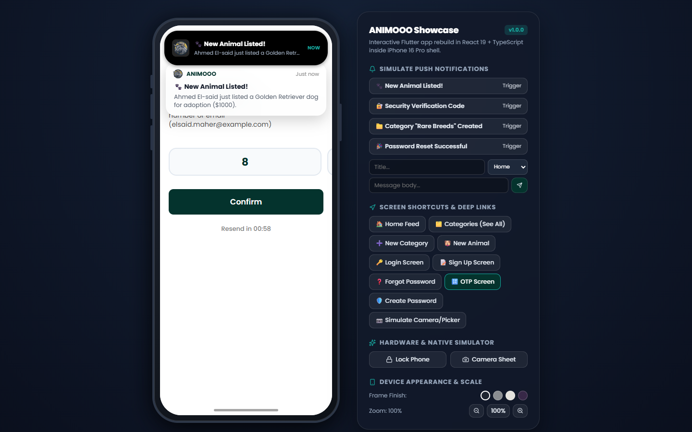
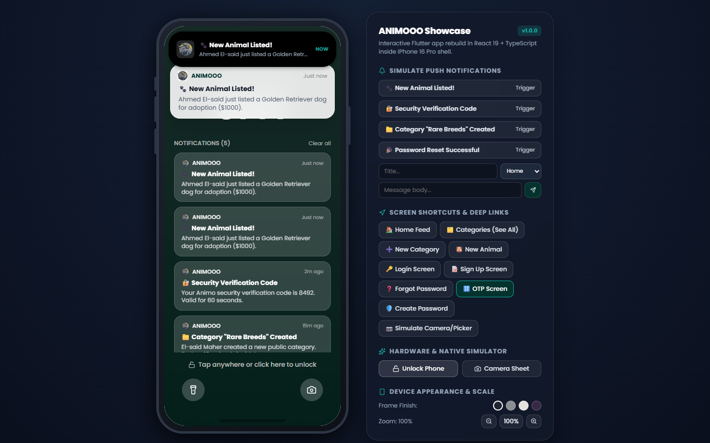
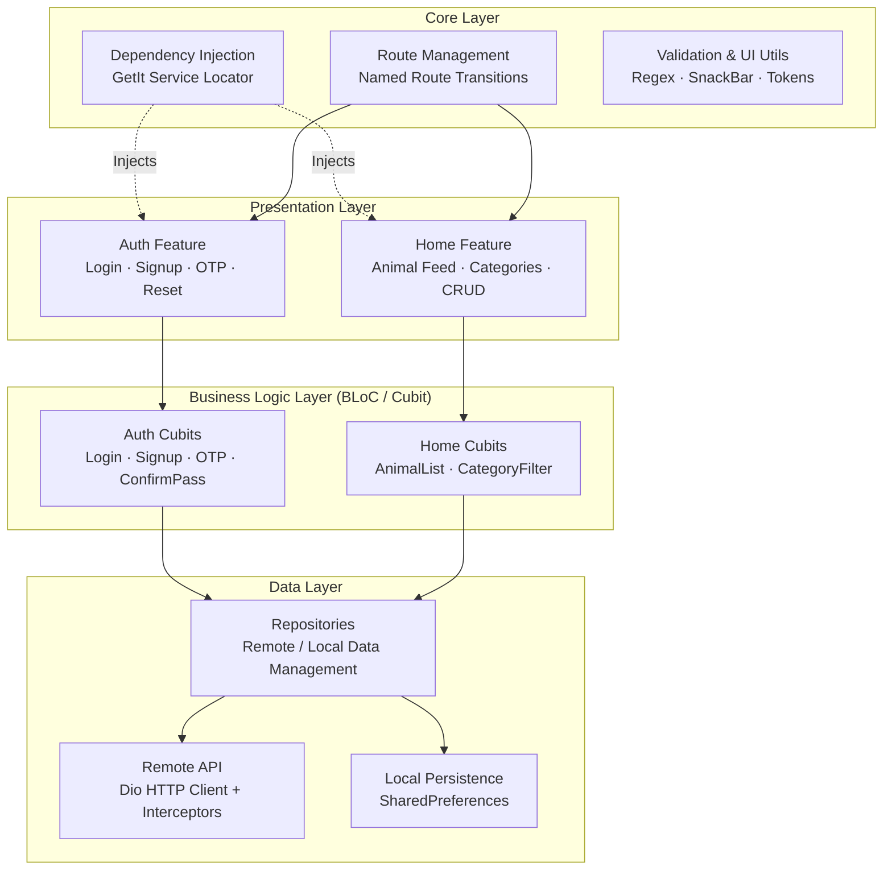

<div align="center">

# 🐾 ANIMOOO - Animal Discovery & Management App

<p align="center">
  <strong>A modern Flutter mobile application with Clean Architecture, BLoC state management, and an interactive React web showcase.</strong>
</p>

[](https://flutter.dev)
[](https://dart.dev)
[](https://bloclibrary.dev)
[](#-architecture-overview)
[](https://elsaidmaher2-10.github.io/animoapp/)
[](#-supported-platforms)

<br/>

### 📱 [🚀 Launch Live Interactive Demo](https://elsaidmaher2-10.github.io/animoapp/) · 📖 [Architecture](#-architecture-overview) · 🚀 [Quick Start](#-getting-started)

<br/>



</div>

---

## 🌟 Overview

**ANIMOOO** is a feature-rich cross-platform animal adoption and listing platform designed to connect pet lovers, shelters, and adopters. Built with Flutter, it implements Clean Architecture principles with **BLoC/Cubit** state management, dependency injection via **GetIt**, RESTful API communication via **Dio**, and local caching using **SharedPreferences**.

In addition to the Flutter mobile codebase, the repository includes a standalone **React 19 + TypeScript interactive showcase** (`/demo`) housed in an **iPhone 16 Pro shell** with push notification triggers, Dynamic Island animations, and hardware simulators.

---

## 🎮 Interactive Live Demo

Experience the app directly in your browser without compiling Flutter! The included demo faithfully recreates every screen, design token, validation rule, and user journey.

👉 **[🌐 Open Live Demo on GitHub Pages (elsaidmaher2-10.github.io/animoapp)](https://elsaidmaher2-10.github.io/animoapp/)**

<div align="center">
  
</div>

### Running the Demo Locally
```bash
# 1. Navigate to the demo directory
cd demo

# 2. Install dependencies
npm install

# 3. Start development server
npm run dev

# 4. Or build & preview production release
npm run build
npm run preview
```

### Demo Highlights:
- 📱 **Hardware Simulation:** Interactive Dynamic Island, iOS 17 status bar, color finish toggles (Midnight, Titanium, Starlight, Deep Purple), and scaling zoom.
- 🔔 **Simulated Push Notifications:** Trigger real notifications ("New Animal Listed", "OTP Code", "Category Updated") with auto-sliding banners and route navigation.
- 🔒 **Lock Screen Simulator:** Working lock screen queue with time/date, swipe-to-unlock, and direct notification deep-linking.
- 📷 **Simulated Native Features:** Photo Gallery & Camera picker bottom sheet, QuickAlert dialogs, and validation snackbars.

---

## 📸 Screen Gallery & Features

<table align="center">
  <tr>
    <td align="center" width="50%">
      
      <br/>
      <strong>🏠 Home Feed & Categories</strong>
      <br/>
      <sub>Dynamic carousel with pet count badges & listing feed</sub>
    </td>
    <td align="center" width="50%">
      
      <br/>
      <strong>🗂️ Category Directory</strong>
      <br/>
      <sub>Filterable grid view with search and real-time counts</sub>
    </td>
  </tr>
  <tr>
    <td align="center" width="50%">
      
      <br/>
      <strong>🔑 Secure Authentication</strong>
      <br/>
      <sub>Email validation, show/hide password, session token storage</sub>
    </td>
    <td align="center" width="50%">
      
      <br/>
      <strong>📝 Registration & Password Security</strong>
      <br/>
      <sub>Live 5-rule password security check & image upload</sub>
    </td>
  </tr>
  <tr>
    <td align="center" width="50%">
      
      <br/>
      <strong>🔢 4-Digit OTP Verification</strong>
      <br/>
      <sub>Auto-advancing digit inputs with 60s countdown resend</sub>
    </td>
    <td align="center" width="50%">
      
      <br/>
      <strong>🔒 iOS Lock Screen</strong>
      <br/>
      <sub>Notification queue with instant deep-link routing</sub>
    </td>
  </tr>
</table>

---

## 🏗️ Architecture Overview

The application follows strict **Clean Architecture** and **Feature-First** structure to ensure separation of concerns, testability, and maintainability:


```mermaid
graph TB
    subgraph "Presentation Layer"
        A["Auth Feature<br/>Login · Signup · OTP · Reset"]
        B["Home Feature<br/>Animal Feed · Categories · CRUD"]
    end
    
    subgraph "Business Logic Layer (BLoC / Cubit)"
        C["Auth Cubits<br/>Login · Signup · OTP · ConfirmPass"]
        D["Home Cubits<br/>AnimalList · CategoryFilter"]
    end
    
    subgraph "Data Layer"
        E["Repositories<br/>Remote / Local Data Management"]
        F["Remote API<br/>Dio HTTP Client + Interceptors"]
        G["Local Persistence<br/>SharedPreferences"]
    end
    
    subgraph "Core Layer"
        H["Dependency Injection<br/>GetIt Service Locator"]
        I["Route Management<br/>Named Route Transitions"]
        J["Validation & UI Utils<br/>Regex · SnackBar · Tokens"]
    end
    
    A --> C
    B --> D
    C --> E
    D --> E
    E --> F
    E --> G
    H -.->|Injects| A
    H -.->|Injects| B
    I --> A
    I --> B
```

---

## 📁 Project Structure

```
animoapp/
├── assets/                    # Image assets, logo SVGs, and custom fonts
│   ├── fonts/                 # OriginalSurfer, Otama-ep, Poppins
│   └── image/                 # App logo, icons, animal photos
├── demo/                      # ⚡ Standalone React 19 Interactive Showcase
│   ├── src/
│   │   ├── shell/             # iPhone Frame, Dynamic Island, Status Bar, Lock Screen
│   │   ├── bridge/            # In-memory navigation, notifications & offline state
│   │   └── app/screens/       # Pixel-faithful React screen rebuilds
│   └── screenshots/           # Full HD demo preview captures
├── lib/
│   ├── core/                  # Shared infrastructure & utilities
│   │   ├── DI/                # GetIt dependency injection setup
│   │   ├── database/          # Local (SharedPrefs) & Remote (Dio) sources
│   │   ├── function/          # Input validators (email, phone, password rules)
│   │   ├── resource/          # Design tokens (ColorManager, AssetValueManager)
│   │   └── routes/            # RoutesManager & RouteName constants
│   ├── feature/
│   │   ├── Auth/              # Login, Signup, OTP, Forgot & Confirm Password
│   │   └── home/              # MainScreen, Feed, Categories, Animal CRUD
│   └── main.dart              # App bootstrap & ScreenUtil responsive initialization
└── screenshots/               # High-res README mockup images
```

---

## 🔧 Core Technologies & Libraries

| Library | Version | Role in Project |
|---|---|---|
| **flutter_bloc** | `^9.1.1` | Predictable state management with unidirectional data flow |
| **get_it** | `^8.3.0` | Service locator for decoupled dependency injection |
| **dio** | `^5.9.0` | HTTP client with automatic token refreshing and error handling |
| **flutter_screenutil** | `^5.9.3` | Responsive UI adaptation scaled to 375x812 base design size |
| **shared_preferences** | `^2.5.4` | Local key-value store for access tokens and user settings |
| **flutter_svg** | `^2.2.3` | Scalable vector graphic asset rendering |
| **quickalert** | `^1.1.0` | Modern animated alert dialogs for auth and actions |
| **dartz** | `^0.10.1` | Functional programming utilities (`Either<Failure, Success>`) |

---

## 🎨 Design System & Typography

- **Primary Brand Color:** `#04332D` (Deep forest emerald)
- **Secondary Accent:** `#16A99F` (Vibrant mint teal)
- **Neutral Card Surface:** `#F6F6F6`
- **Typography:**
  - `OriginalSurfer`: Branding titles & animal descriptions
  - `Otama-ep`: Elegant serif display headers
  - `Poppins`: Clean modern UI body & button labels

---

## 🚀 Getting Started with Flutter

### Prerequisites
- Flutter SDK `^3.9.2`
- Dart SDK `^3.9.2`

### Setup & Run
```bash
# 1. Clone repository
git clone https://github.com/elsaidmaher2-10/animoapp.git
cd animoapp

# 2. Install dependencies
flutter pub get

# 3. Launch the app on connected emulator or device
flutter run
```

### Build Releases
```bash
# Android APK
flutter build apk --release

# iOS Bundle
flutter build ios --release

# Web Build
flutter build web --release
```

---

## 👤 Author

**El-said Maher**  
- GitHub: [@elsaidmaher2-10](https://github.com/elsaidmaher2-10)

---

<div align="center">
  <sub>Built with ❤️ using Flutter and React. Star ⭐ this repository if you find it helpful!</sub>
</div>
